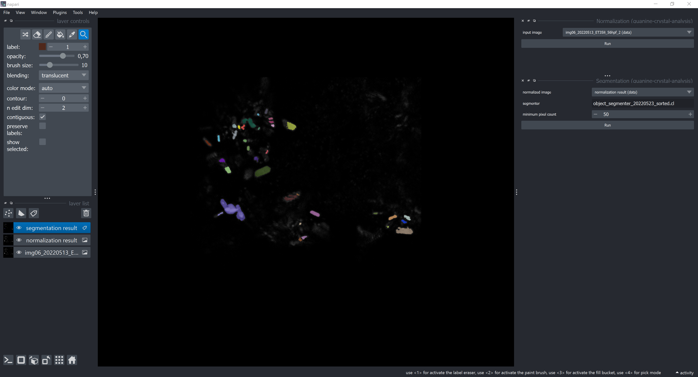
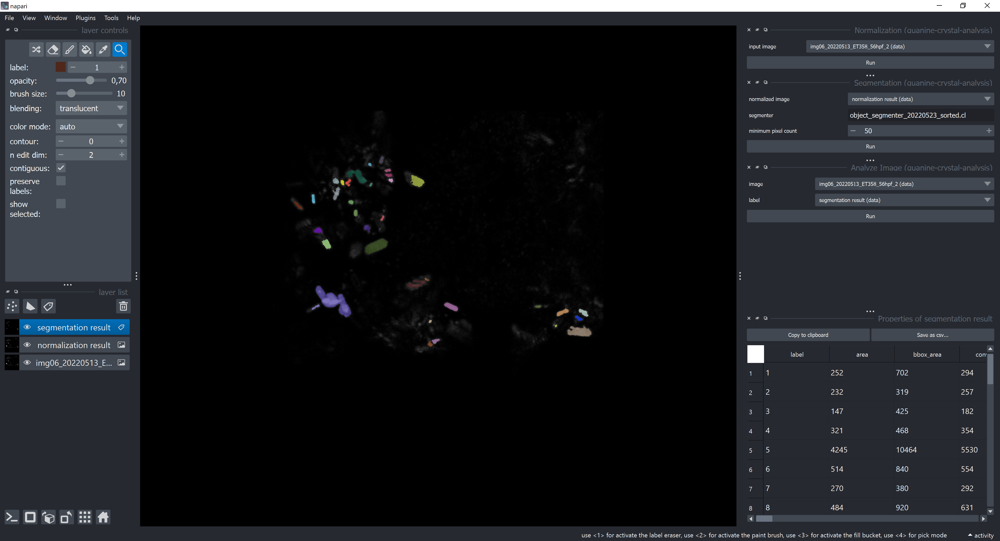
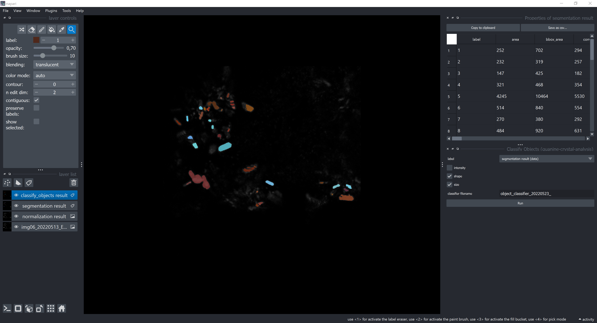
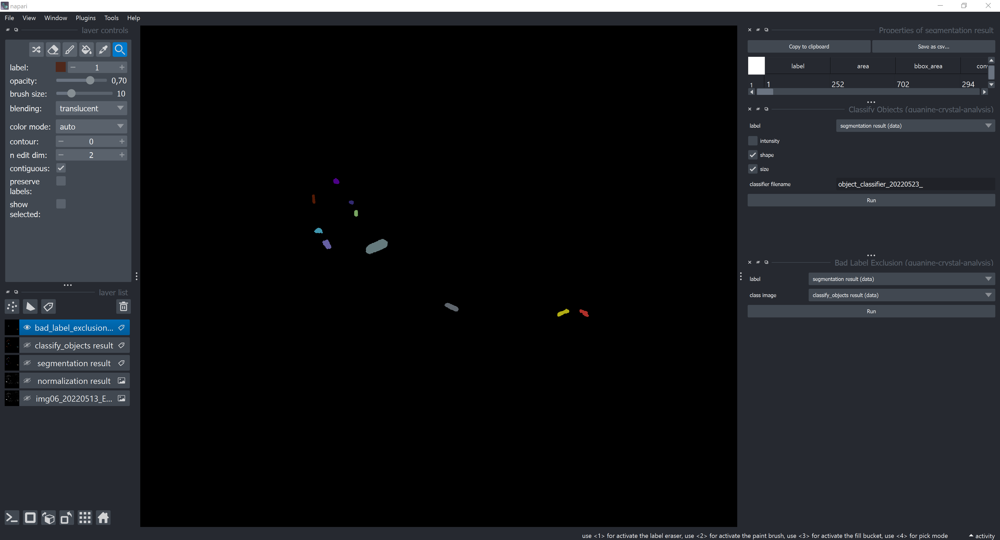
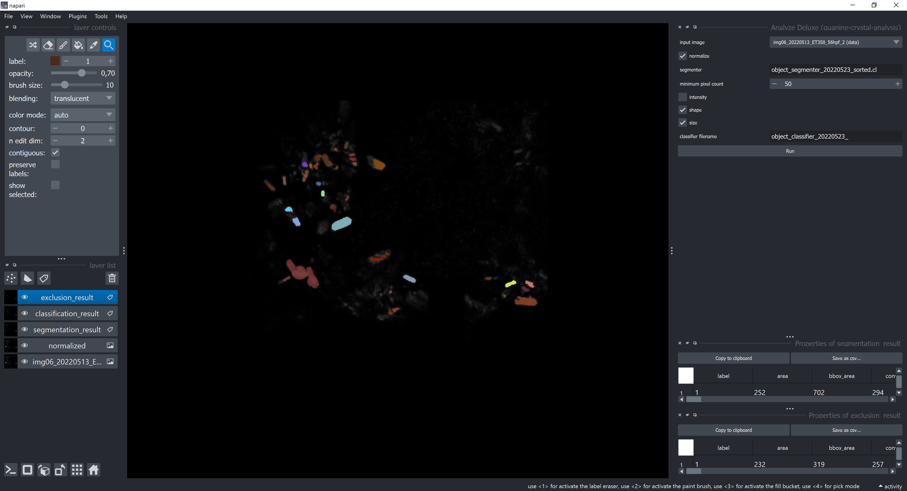

# guanine-crystal-analysis

A plugin for guanine crystal segmentation and classification in the zebrafish eye. More precisely, it provides a workflow that measures on guanine crystal labels and sorts out overlaying partially segmented crystals during classification.

This [napari] plugin was generated with [Cookiecutter] using [@napari]'s [cookiecutter-napari-plugin] template.

<!--
Don't miss the full getting started guide to set up your new package:
https://github.com/napari/cookiecutter-napari-plugin#getting-started

and review the napari docs for plugin developers:
https://napari.org/plugins/index.html
-->

## Usage 

This plugin is suited for users who
- want to derive size-, shape and intensity-based parameters from individual guanine crystals
- struggle with partially segmented or overlapping crystals
- want to investigate further the size and shape of these guanine crystals

This plugin is not suited for users who 
- are interested in further investigations of intensity of guanine crystals

You can find the plugin in napari under `Pugins` → `guanine-crystal-analysis`

### 1. Normalization

You can normalize the image selecting `Normalization` where you only need to specify your input image and click on the `Run` button. 

Normalizing the image helps to adjust the intensity values and needs to be applied here because the object segmenter is only trained on normalized images.

### 2. Segmentation

When selecting `Segmentation`, you need to select the normalized image and a minimum pixel count of label images and click on the `Run` button again.

This avoids having too small and unhelpful labels and is set by default to 50 pixels.

### 3. Analyze Image

Under `Analyze Image`, you can derive measurements from your image and label image by selecting them and clicking on the `Run` button.  

The derived measurements are a combination of the two libraries [napari-skimage-regionprops](https://github.com/haesleinhuepf/napari-skimage-regionprops) and [napari-simpleitk-image-processing](https://github.com/haesleinhuepf/napari-simpleitk-image-processing). They can be devided into size-, shape-, and intensity-based parameters: 

| **size** | **shape**                 | **intensity**  
|----------|---------------------------|-------------------|
| area     	| aspect ratio              	| maximum intensity 	|
|          	| perimeter                 	| mean intensity    	|
|          	| major-axis-length         	| minimum intensity 	|
|          	| minor-axis-length         	| median            	|
|          	| circularity               	| sum               	|
|          	| solidity                  	| variance          	|
|          	| eccentricity              	|                   	|
|          	| roundness                 	|                   	|
|          	| perimeter-on-border       	|                   	|
|          	| perimeter-on-border-ratio 	|                   	|

Some of the guanine crystals are not correctly segmented because of overlay or interference patterns. This problem is addressed with the help of a classification step demonstrated next

### 4. Classify Objects

You can divide the crystal labels into predicted (blue) and discarded (brown) crystal labels using `Classify Objects`. There you can choose classifiers trained on intensity-, shape- and/or size-based parameters with the help of the checkboxes.

It is recommended to later on not measure the parameters that the classifier was trained on, but other ones.

### 5. Bad Label Exclusion

Now, you can get rid of the discarded (brown) labels for further analysis using `Bad Label Exclusion`. Select the two label images of segmentation and classification result and press the `Run` button again. 

The result is a label image with only the predicted (blue) labels which are relabeled sequentially. If you want to derive measurements on these predicted labels, you can just use  `Analyze Image` again.

### "Analyze Deluxe"

You can also do all the explained steps in one click using the `Analyze Deluxe` function.

## Installation

You can install `guanine-crystal-analysis` via [pip]:

    pip install guanine-crystal-analysis

To install latest development version :

    pip install git+https://github.com/biopo/guanine-crystal-analysis.git

## Contributing

Contributions are very welcome. Tests can be run with [tox], please ensure
the coverage at least stays the same before you submit a pull request.

## Acknowledgements
This project was done in collaboration with the [Rita Mateus Laboratory](https://www.ritamateus.com/) and was supported by the Deutsche Forschungsgemeinschaft under Germany’s Excellence Strategy – EXC2068 - Cluster of Excellence "Physics of Life" of TU Dresden. 
This project has been made possible in part by grant number [2021-240341 (Napari plugin accelerator grant)](https://chanzuckerberg.com/science/programs-resources/imaging/napari/improving-image-processing/) from the Chan Zuckerberg Initiative DAF, an advised fund of the Silicon Valley Community Foundation.

## License

Distributed under the terms of the [BSD-3] license,
"guanine-crystal-analysis" is free and open source software

## Issues

If you encounter any problems, please [file an issue] along with a detailed description.

[napari]: https://github.com/napari/napari
[Cookiecutter]: https://github.com/audreyr/cookiecutter
[@napari]: https://github.com/napari
[MIT]: http://opensource.org/licenses/MIT
[BSD-3]: http://opensource.org/licenses/BSD-3-Clause
[GNU GPL v3.0]: http://www.gnu.org/licenses/gpl-3.0.txt
[GNU LGPL v3.0]: http://www.gnu.org/licenses/lgpl-3.0.txt
[Apache Software License 2.0]: http://www.apache.org/licenses/LICENSE-2.0
[Mozilla Public License 2.0]: https://www.mozilla.org/media/MPL/2.0/index.txt
[cookiecutter-napari-plugin]: https://github.com/napari/cookiecutter-napari-plugin

[file an issue]: https://github.com/biopo/guanine-crystal-analysis/issues

[napari]: https://github.com/napari/napari
[tox]: https://tox.readthedocs.io/en/latest/
[pip]: https://pypi.org/project/pip/
[PyPI]: https://pypi.org/
